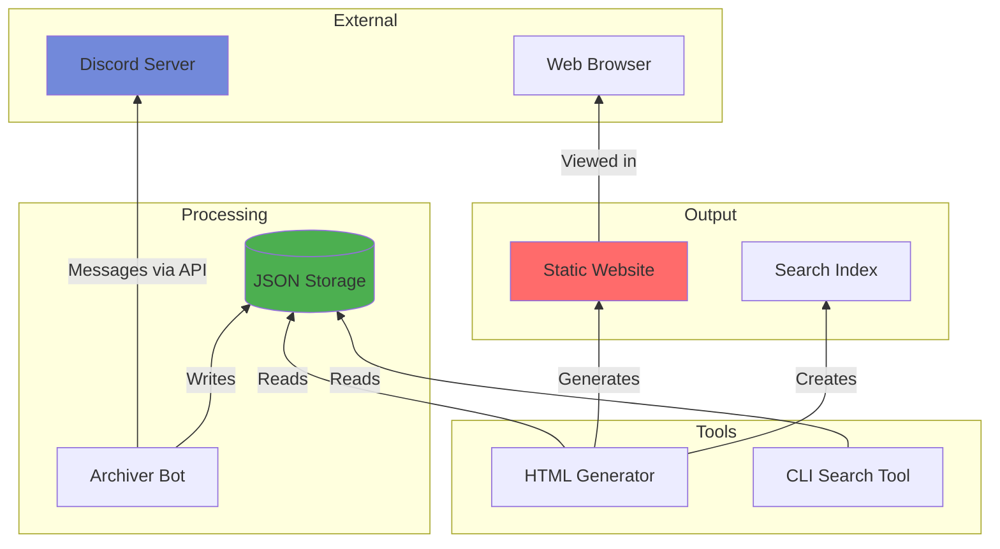

# Discord Archive

A complete Discord server archiving system with full-text search capabilities. Archive your Discord server messages and view them in a Discord-like static website.

### Table of Contents
- [Quick Start](#quick-start)
- [Installation](#installation)
  <!-- - [Discord Bot Setup](#discord-bot-setup) -->
- [Usage](#usage)
- [Project Structure](#project-structure)
- [Core Components](#core-components)
<!-- - [Configuration](#configuration) -->


## Quick Start

```bash
# 1) First-time setup (installs deps + creates .env)
python run.py setup

# 2) Edit .env and add your Discord bot token
# DISCORD_BOT_TOKEN=your_bot_token_here

# 3) Start archiving (uses interactive console if no flags)
python run.py start

# 4) Generate HTML and view in your browser
python run.py view
```

Ready to go! The `run.py` script works on **Windows, Linux, and macOS**.


## Installation

### Prerequisites
- Python 3.8 or higher
- Discord bot token ([Discord Bot Setup](#discord-bot-setup))

### Setup

1. **Clone or download this repository**

2. **Install dependencies**
   ```bash
   python run.py setup
   ```
   This will:
   - Install required packages (`discord.py`, `rich`, `questionary`)
   - Create a `.env` configuration file

3. **Configure your bot token**
   
   Edit `.env` and add your Discord bot token:
   ```env
   DISCORD_BOT_TOKEN=your_bot_token_here
   UPDATE_INTERVAL_HOURS=24
   ARCHIVE_PATH=./discord_archive
   HTML_OUTPUT_PATH=./discord_html
   SERVER_PORT=8000
   ```

### Discord Bot Setup

#### 1. Create the Bot

1. Go to [Discord Developer Portal](https://discord.com/developers/applications/)
2. Click **New Application** → Give it a name (e.g., `ArchiverBot`)
3. Go to **Bot** → Click **Add Bot**

#### 2. Get the Bot Token

1. In **Bot** settings → Click **Reset Token** / **Copy Token**
2. Save this token securely (you'll need it for `.env`)

#### 3. Enable Required Intents

In **Bot** settings, enable:
- ✅ **Message Content Intent**
- ✅ **Server Members Intent**

#### 4. Invite Bot to Your Server

1. Go to **OAuth2** → **URL Generator**
2. Under **Scopes**, check:
   - ✅ `bot`
3. Under **Bot Permissions**, check:
   - ✅ View Channels
   - ✅ Read Message History
   - ✅ Send Messages
   - ✅ Embed Links
4. Copy the generated URL and open it in your browser
5. Select your server and authorize

#### 5. Private Channel Access (Optional)

For private channels:
1. Open the channel → **Edit Channel** → **Permissions**
2. Add the bot role and allow:
   - ✅ View Channels
   - ✅ Read Message History

#### 6. Testing & Validation (Optional)

To test the archiver with dummy data, use `dummy_messages.py`:

1. **Add your Guild ID to `.env`:**
   ```env
   DISCORD_GUILD_ID=your_server_id_here
   ```

2. **Ensure bot has additional permissions:**
   - ✅ Manage Channels (create categories/channels)
   - ✅ Manage Webhooks

3. **Run the dummy message generator:**
   ```bash
   python dummy_messages.py
   ```

This will create a "Seeded Validation" category with test channels containing ~5000 dummy messages from simulated users, perfect for testing the archiver and HTML generator.

## Usage

### CLI Commands

**The `run.py` script provides a simple interface for all operations (Recommended usage):**

#### Setup Commands
```bash
python run.py setup          # Install dependencies and create .env
python run.py status         # Show current status and archiever settings
```

#### Archiver Commands
```bash
python run.py start [options]    # Start archiver in background (interactive console if no flags)
python run.py stop               # Stop background archiver
python run.py archive [options]  # Run archiver in foreground
python run.py logs               # Show archiver logs
python run.py status             # Show current status and settings
```

**Archiver Options:**
| Option | Description |
|--------|-------------|
| `--include-bots` | Include bot-authored messages (default: off) |
| `--limit N` | Limit messages per channel (default: unlimited) |
| `--channel NAME/ID` | Only archive specific channel (can repeat) |
| `--download-attachments` | Download images/files locally (default: off) |
| `--delay N` | Delay N seconds between API batches to avoid rate limits |

**Examples:**
```bash
# Archive everything
python run.py start

# Archive only 100 messages per channel
python run.py start --limit 100

# Archive only specific channels
python run.py start --channel general --channel announcements

# Download all attachments (images, files) locally
python run.py start --download-attachments

# Avoid rate limits with delay (recommended for large archives)
python run.py start --delay 1

# Combine options
python run.py start --limit 500 --channel general --include-bots --download-attachments --delay 0.5
```

#### HTML Commands
```bash
python run.py generate       # Generate HTML from archive
python run.py serve [port]   # Start local web server (default: 8000)
python run.py view [port]    # Generate HTML and start server
```


### Direct Script Usage

You can also run the scripts directly:

#### Archive Messages
```bash
python discord_archiver.py <BOT_TOKEN> [update_interval_hours] [archive_path] [options]

# Options:
#   --include-bots         Include bot-authored messages
#   --limit N              Limit messages per channel
#   --channel NAME/ID      Only archive specific channel (can repeat)
#   --download-attachments Download images/files locally
#   --delay N              Delay N seconds between API batches

# Examples:
python discord_archiver.py "your-token" 24 ./discord_archive
python discord_archiver.py "your-token" 0  # Disable auto-update
python discord_archiver.py "your-token" 24 ./archive --limit 100 --channel general
python discord_archiver.py "your-token" 6 ./my_archive --include-bots
```

#### Generate HTML
```bash
python html_generator.py [archive_path] [output_path]

# Example:
python html_generator.py ./discord_archive ./discord_html
```


## Project Structure




```
discord-archive/
├── run.py                    # CLI 
├── discord_archiver.py       # Discord archiving bot
├── html_generator.py         # Static HTML + search index generator
├── archive_search.py         # Search tool
├── requirements.txt          # Python dependencies
├── .env                      # Configuration (created by setup)
│
├── templates/               # HTML templates
│   ├── index.html           # Main index page template
│   ├── channel.html         # Channel page template
│   ├── style.css            # Styling
│   ├── script.js            # Search engine + UI logic
│   └── components/
│       ├── sidebar.html
│       ├── channel_header.html
│       └── search_modal.html
│
├── discord_archive/          # Archived data (JSON)
│   ├── metadata.json
│   └── server_<id>/
│       ├── server_info.json
│       ├── channels.json
│       └── channel_<id>/
│           ├── messages.json
│           ├── messages.txt
            └── attachments/ # (optional) downloaded files
               └── <msgid>_<filename>
│
└── discord_html/             # Generated HTML output
    └── server_<id>/
        ├── index.html
        ├── style.css
        ├── script.js
        ├── channel_<id>_p<num>.html
        ├── search_manifest.json
        └── search_index_<num>.json
```

## Core Components

### 1. `discord_archiver.py`
The main archiving bot that connects to Discord and fetches messages.

**Features:**
- Connects via Discord bot token
- Fetches complete message history
- Preserves all metadata (attachments, embeds, reactions, replies)
- Incremental updates (only new messages)
- Auto-update scheduling
- Bot message filtering (`--include-bots` flag)
- Message limit per channel (`--limit N` flag)
- Channel filtering (`--channel NAME/ID` flag)
- Local attachment download with retry logic (`--download-attachments` flag)
- Rate limit prevention (`--delay N` flag)

**Output:**
```
discord_archive/
├── metadata.json              # Archive metadata
└── server_<id>/
    ├── server_info.json       # Server name, member count, etc.
    ├── channels.json          # Channel list
    └── channel_<id>/
        ├── messages.json      # Full message data
        ├── messages.txt       # Plain text backup
        └── attachments/       # Downloaded files (if --download-attachments)
            └── <msgid>_<filename>
```

### 2. `html_generator.py`
Converts JSON archives into a static website with Discord-like interface.

**Features:**
- Discord-like UI
- Pagination support (configurable messages per page)
- Generates search index (chunked for scalability)

**Output:**
```
discord_html/
└── server_<id>/
    ├── index.html                  # Main page with channel list
    ├── style.css                   # Styling
    ├── script.js                   # Search + UI logic
    ├── channel_<id>_p<num>.html   # Paginated channel pages
    ├── search_manifest.json        # Search metadata
    └── search_index_<num>.json    # Chunked message index
```

### 3. Search Functionality

**Web Search (Client-Side JavaScript)** - Primary search method that works entirely in the browser for static hosting compatibility.

**How it works:**
1. `html_generator.py` creates search index files:
   - `search_manifest.json` - Metadata (channels, authors, date ranges)
   - `search_index_<N>.json` - Chunked message data (5000 messages per chunk)

2. `script.js` performs client-side search:
   - Lazy loads index chunks on-demand
   - Filters by text, author, channel, and date
   - Links directly to messages: `channel_<id>_p<page>.html#msg-<id>`
   - No server required - all search happens in the browser

**Index Format:**
```json
// search_manifest.json
{
  "totalMessages": 1234,
  "totalChunks": 3,
  "channels": {"channel_id": {"name": "general", "category": "Text Channels"}},
  "authors": ["Alice", "Bob", "Charlie"]
}

// search_index_<N>.json
[
  {
    "i": 123456789,      // message id
    "c": "channel_id",   // channel id  
    "a": "Author Name",  // author
    "t": "2025-01-15",   // date
    "x": "Message text", // content (truncated to 500 chars)
    "p": 1               // page number
  }
]
```

**CLI Tool:** `archive_search.py` - Optional command-line tool for searching raw JSON files


### 4. `run.py`
Cross-platform CLI helper script for managing the entire workflow.

**Features:**
- Works on Windows, Linux, and macOS
- **Interactive Console**: Run `start` without flags to configure options interactively.
- **Rich UI**: Progress bars and status displays.
- Simplified command interface
- Real-time progress display during archiving
- Automatic dependency installation
- Configuration management
- Web server with auto-open browser
- Supports all archiver options (`--include-bots`, `--limit`, `--channel`)

## Configuration

### `.env` File
```env
# Discord bot token (required)
DISCORD_BOT_TOKEN=your_bot_token_here

# Auto-update interval in hours (0 to disable)
UPDATE_INTERVAL_HOURS=24

# Archive storage path
ARCHIVE_PATH=./discord_archive

# HTML output path
HTML_OUTPUT_PATH=./discord_html

# Web server port
SERVER_PORT=8000
```

### `html_generator.py` Settings
- `messages_per_page`: Messages per HTML page (default: 500)
- `index_chunk_size`: Messages per search chunk (default: 5000)


## Contributing

Contributions are welcome! Please feel free to submit issues or pull requests.