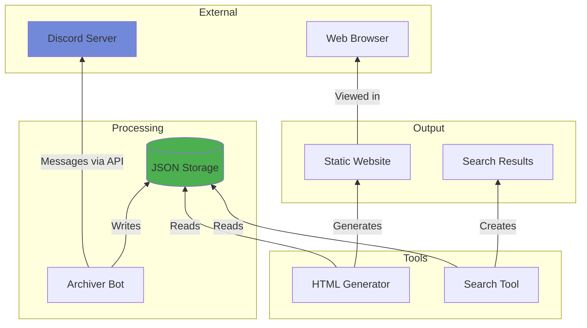

# Discord Archive 

## Overview




## Core Scripts

The Discord Archive System consists of three main Python scripts that work together to archive, display, and search Discord server data.

### 1. **discord_archiver.py** 
*The main archiving script that fetches and stores Discord data*

- Connects to Discord via bot token
- Fetches complete message history
- Preserves all message metadata
- Auto-update scheduling (Configurable update intervals)
    - Background task execution


#### Output:
```
discord_archive/
├── metadata.json
└── server_123456789/
    ├── server_info.json
    ├── channels.json
    └── channel_*/
        ├── messages.json
        └── messages.txt
```

### 2. **html_generator.py**
*Converts JSON archives into a static website with Discord-like interface*

- Discord-like UI
- Pagination support

```
discord_html/
└── server_123456789/
    ├── index.html
    ├── style.css
    ├── script.js
```


### 3. **search_tool.py**
*Search across archived messages*

- **Multi-filter Searching**
- Filtering capabilities like:
    - Filter by author/user
    - Filter by channel
    - Date range
    - Combine multiple filters
- Export to Multiple Formats
    - JSON
    - TXT


